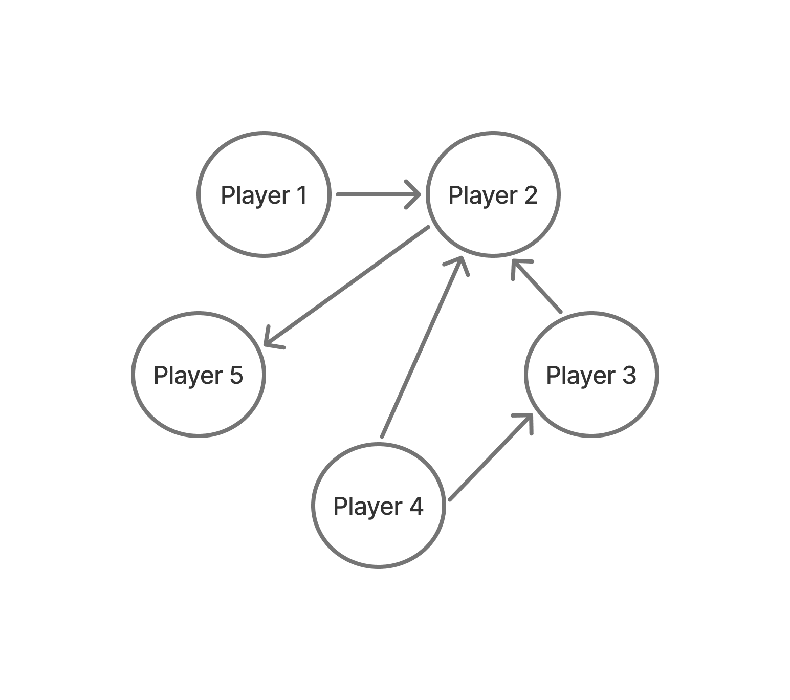

# [순위](https://school.programmers.co.kr/learn/courses/30/lessons/49191)

선수들의 승패 결과가 주어졌을 때, 각 선수의 순위를 구하는 문제이다.

[승자,패자]의 배열이 다음과 같이 주어졌을 때 그래프로 나타내면 다음과 같다.



## 풀이 방식

각 플레이어별로 이김, 짐 그래프를 만들고 승패를 겨룬 플레이어들을 순회한다.

위 그래프를 예시로 들면,

플레이어5: 플레이어2에게 승리, 플레이어2는 3회 승리 -> 1위.

플레이어2: 3회 승리, 1회 패배 -> 2위.

즉, 자신의 승패를 겨룬 플레이어를 탐색하여 총 승패 횟수를 세어 순위를 구할 수 있다.

```JavaScript
function solution(n, results) {
    const winGraph = Array.from({ length: n + 1 }, () => []);
    const loseGraph = Array.from({ length: n + 1 }, () => []);

    // 방향 그래프 만들기
    for (const [winner, loser] of results) {
        winGraph[winner].push(loser); // winner가 이긴 사람들
        loseGraph[loser].push(winner); // loser가 진 사람들
    }

    // DFS 함수
    function dfs(graph, start) {
        const visited = Array(n + 1).fill(false);
        const stack = [start];
        visited[start] = true;
        let count = 0;

        while (stack.length) {
            const current = stack.pop();
            for (const next of graph[current]) {
                if (!visited[next]) {
                    visited[next] = true;
                    stack.push(next);
                    count++;
                }
            }
        }
        return count;
    }

    let answer = 0;

    for (let i = 1; i <= n; i++) {
        const winCount = dfs(winGraph, i);   // 자신이 이긴 사람 수
        const loseCount = dfs(loseGraph, i); // 자신이 진 사람 수

        if (winCount + loseCount === n - 1) {
            answer++;
        }
    }

    return answer;
}

```
